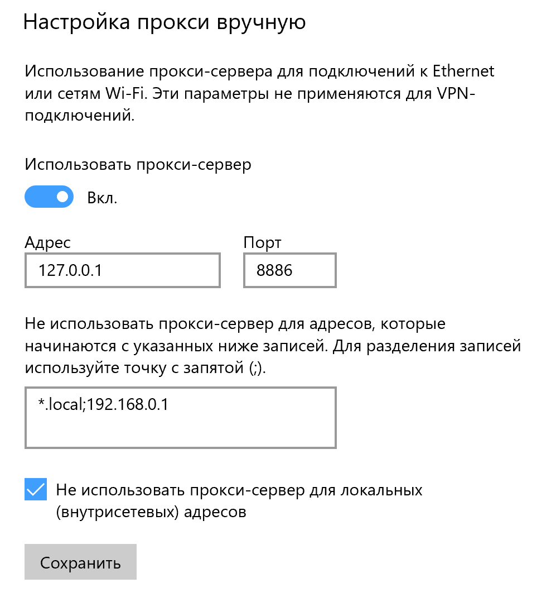

Windows Proxy Boilerplate [TS]

###Dependencies:

- http-proxy
- transparent-proxy


####This template was created for use with a system proxy on Windows 10



On Windows 10, I cannot configure the system proxy with credentials for authentication, so ...
```text
windows -> request ->  transparent-proxy -> http-proxy-with-auth -> target
```

###Usage:
